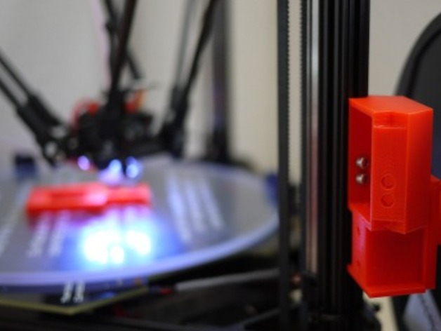

# Kossel Pro Spool Adapter

This is a spool adapter for the Kossel Pro. It mounts to an aluminum 1515 OpenBeam
extrusion using two M3 x 6mm BHCS (or the longer M3 x 8mm SHCS) that are included
in the Kossel Pro kit.

Version two of the original spool adapter adds three different
mounting types for different cold end orientations (keeping the upright orientation, and
adding two different side orientations).

Being just an adapter, you'll need compatible spool holders, and these come in various
shapes and sizes. Look below under the 'tested with' for more information.

## Print settings

30% infill, .2 layers. Orient the print so that it is face down with the side holes
printed last.

Mounting hardware/instructions:

2x M3 x 6mm BHCS OR 2x M3 x 8mm SHCS

and

2x M3 nuts

Pre-threading things onto the adapter is recommended to take up any tolerances in printing,
as well as making the actual mounting easier.

Installation is best done with the printer on it's side. Insert the hex nuts,
and pre-insert the screws into the printed holder. Line everything up and secure with the appropriate driver.

Tested with:

[Customizable Spool Holder for Replicator 2](http://www.thingiverse.com/thing:44906)

## License

[CC0 1.0 Universal Public Domain Dedication](https://creativecommons.org/publicdomain/zero/1.0/)
